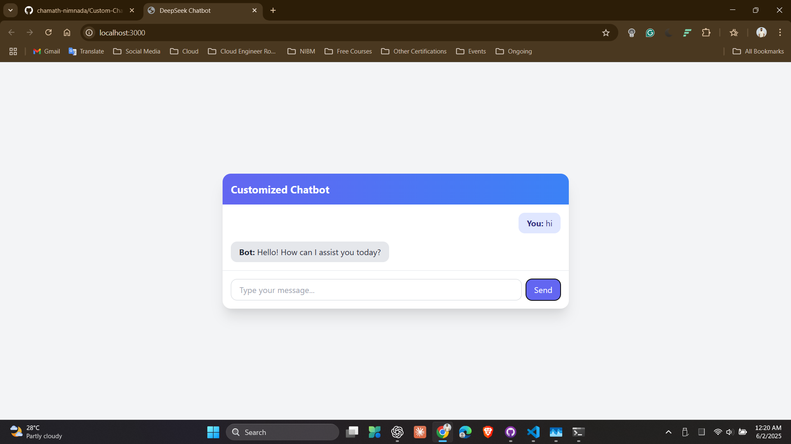

# 🧠 DeepSeek Chatbot

A simple, fast, and fully local chatbot built with Node.js, Tailwind CSS, and the `deepseek-r1` language model running through [Ollama](https://ollama.com/). This chatbot answers only based on custom knowledge provided by the user.

---

## 🚀 Features

- 🔒 Private & offline (runs locally via Ollama)
- 📄 Loads custom data from `data.txt`
- 💬 Simple modern web UI with TailwindCSS
- ⚡ Fast inference using `deepseek-r1:latest`
- ❓ Responds only if the answer is in your context

---

## 📸 Screenshot



---

## 🧰 Tech Stack

- **Frontend**: HTML + TailwindCSS
- **Backend**: Node.js (Express.js)
- **LLM**: DeepSeek-R1 via Ollama

---

## 📁 Folder Structure
deepseek-chatbot/
├── public/
│ └── index.html # Frontend (Chat UI)
├── data.txt # Your custom knowledge base
├── documentLoader.js # Loads data from file
├── ollama.js # Handles communication with Ollama
├── server.js # Main Express backend
└── README.md # Project documentation

---

## ⚙️ Prerequisites

- [Node.js](https://nodejs.org/) (v18+ recommended)
- [Ollama](https://ollama.com/) installed and running
- `deepseek-r1:latest` model pulled via Ollama:

```bash
ollama pull deepseek-r1:latest
